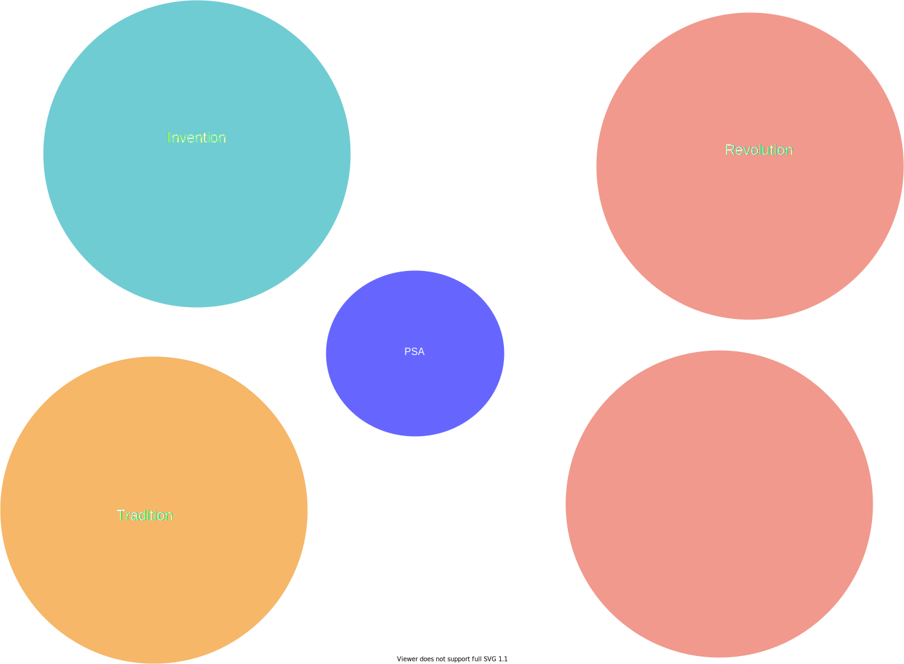

# Scholarly work

## Summary of research

My research aims to improve outcomes for patients undergoing procedures with sedation. This program of research was heavily influenced by my clinical experience working as a nurse in the cardiac catheterization laboratory. Prior to joining Bloomberg Nursing and the Peter Munk Cardiac Centre in my role as RBC Chair in Cardiovascular Nursing Research in September 2018, I practiced as a Registered Nurse in the cardiac catheterization laboratory (CCL) setting in Australia for more than 10 years. I was actively involved in clinical research throughout this time. Through my clinical and research experience, I have developed an in-depth understanding of challenges associated with operational issues as well as practical insights into feasible and effective approaches to the conduct of nursing research within this setting. This first-hand practical knowledge and experience ensures the research I undertake is pragmatically designed to optimize participant recruitment, data collection and outcome measurement procedures. 

Since my arrival in Canada, I have established new collaborations with researchers and clinicians who posses the complementary expertise required to make significant contributions to the evidence base underlying procedural sedation and analgesia. These include clinical collaborators within the discipline of nursing, as well as in the field of radiology and anesthesiology, but also academic collaborators from computer science and engineering departments at the University of Toronto. Collaborating with these researchers from diverse fields has enabled me to pursue  

{width="100%"}

To date, my knowledge dissemination activities include 50 peer-reviewed full-length journal articles, two editorials and a book chapter. As of June 8, 2021, I have 533 citations of my work listed in the Scopus database with a *h*-index of 12. Google scholar metrics include 1016 citations to my work with a *h*-index of 16.  

To summarize, 

Award

Lawrence S. Bloomberg Faculty of Nursing Early Career Teaching Award. This award recognizes consistent outstanding performance in teaching and is peer nominated.

