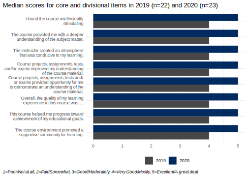

# Approach to teaching {.first-h1}


<blockquote>
  <span>
  Teaching philosophy
  </span>
  I believe the approach I have taken to teaching has been strongly shaped by my experience as a clinician and researcher. In my clinical practice, I deliver patient-centered evidence-based care. In my teaching, I strive to deliver student-centered evidence-based learning opportunities. 
</blockquote>


## Teaching goals

fjksdjdas

## Teaching methods and strategies

Online

Interactive

Engaging

# Teaching and mentoring contributions

## University Teaching

Brief summary

Please note that I have one course release each academic year associated with my appointment to the RBC Chair of Cardiovascular Nursing Resarch role at the Peter Munk Cardiac Centre.

### Summary of courses taught in tenure-track position (2018-2021)

| Term, Year   | Course number | Course name                                                  | Level    | Class size |
| ------------ | ------------- | ------------------------------------------------------------ | -------- | ---------- |
| Fall, 2019   | NUR1027       | Integrated Approaches to Research Appraisal and Utilization, Part 1 | Graduate | 31         |
| Winter, 2020 | NUR1127       | Integrated Approaches to Research Appraisal and Utilization, Part 2 | Graduate | 31         |
| Fall, 2020   | NUR1027       | Integrated Approaches to Research Appraisal and Utilization, Part 1 | Graduate | 36         |
| Winter, 2021 | NUR1127       | Integrated Approaches to Research Appraisal and Utilization, Part 2 | Graduate | 36         |

### Graduate courses

#### NUR1027

Summary

Course changes

#### NUR1127

Summary Course changes

### Guest lectures

I was invited to deliver lectures in a graduate course based on my skills in advanced data analytics and research experience related to critical care. 75% of the students attending my seminar on Nursing Perspectives in Resuscitation Science Research rated the quality of the presentation as excellent. 

| Term, Year   | Course number | Course name                                   | Level    | Class size | Content                                                |
| ------------ | ------------- | --------------------------------------------- | -------- | ---------- | ------------------------------------------------------ |
| Winter, 2020 | NUR1059       | INFORMATICS AND TECHNOLOGY                    | Graduate | 17         | Data Visualization                                     |
| Winter, 2020 | NUR1059       | INFORMATICS AND TECHNOLOGY                    | Graduate | 17         | Data transformation                                    |
| Winter, 2020 | MSC4001H      | Foundations in Resuscitation Science Research | Graduate | 20         | Nursing Perspectives in Resuscitation Science Research |

### Student supervision

#### Summary of doctoral student supervision

| Student name          | Program                                        | Year start | Year finish | Role       |
| --------------------- | ---------------------------------------------- | ---------- | ----------- | ---------- |
| Navpreet Kamboj       | PhD - Bloomberg Nursing, University of Toronto | 2019       | 2023        | Supervisor |
| Mohammad Goudarzi-Rad | PhD - Bloomberg Nursing, University of Toronto | 2021       | 2025        | Supervisor |

#### Doctoral supervision

I have been the primary supervisor for one PhD student for the past 2 years and will commence supervision of a new student in the fall of 2021.

**Navpreet Kamboj**

*Lawrence S. Bloomberg Faculty of Nursing*

Navpreet was accepted into the program in 2019. She previously complete a MN (Thesis) degree at Western University and workds clinically at Trillium. Navpreet's research aims at using machine learning to predict changes in blood pressure after nitroglycerin dose titrations. Her research builds upon her nursing experience in the coronary care unit. Navpreet is on track to meet her milestones for PhD completion. She has a systematic review currently under review in the journal *Intensive & Critical Care Nursing*.

**Mohammad Goudarzi-Rad**

*Lawrence S. Bloomberg Faculty of Nursing*

Mohammad is an international student who has just been accepted into the PhD Program. Mohammad has extensive nursing experience in cardiovascular care along with a developing track record in research. He has co-authored several articles with colleagues in Iran and recently published results of the research he undertook for his Masters thesis. Mohammad is interested in exploring nurses' perceptions of using information about predictions from machine learning models in the clinical decision-making process.

#### Summary of undergraduate supervision

| Student name      | Program                 | Year start | Year finish | Role |
| -------------- | ----------------------- | ---------- | ----------- | ---- |
| Dan Phan       | BScN work study program | Fall, 2019 | Winter, 2020 | Supervisor |
| Megan Bittner  | BScN work study program | Fall, 2019 | Winter, 2020 | Supervisor |
| Dan Phan | BScN work study program | Summer, 2019 | Summer, 2019 | Supervisor |
| Megan Bittner | BScN Summer Research Program – Nursing, University of Toronto | Summer, 2019 | Summer, 2019 | Supervisor |
| Kevin Auw-Yang | UTSC Co-op | Fall, 2019 | Spring, 2020 | Supervisor |

#### Undergraduate student supervision

**Megan Bitner, Undergraduate Summer Research Placement, Summer 2019**

During the Undergraduate Summer Research Placement, Megan worked on a research project related to transcutaneous carbon dioxide monitoring for detection of respiratory depression during sedation. I provided Megan with targeted education and guidance around building skills related to using R for data analysis. The goals, activities and resources I prepared for Megan are presented [here](https://awconway.github.io/USSRP.html). Megan also contributed to a systematic review during here summer research placement, which was subsequently published in the [Journal of Clinical Monitoring and Computing](http://link.springer.com/article/10.1007/s10877-020-00543-6).

**Dan Phan, BScN Work Study Program, Summer 2019**

One aspect of my research involved temperature management. Dan worked assisted with undertaking a systematic review of zero heat flux thermometers. The goals, activitied and resources I provided to support Dan during this learning experience are provided [here](https://awconway.github.io/ZHF-review.html). The systematic review was subsequently published in the [Journal of Clinical Monitoring and Computing](http://link.springer.com/article/10.1007/s10877-020-00543-6).

**Megan Bitner and Dan Phan, BScN Work Study Program, Fall 2019/Winter 2020**

After a successful work term over the summer, I decided to hire both Megan and Dan during the fall. This work study placement involved data collection for a prospective study conducted at the Peter Munk Cardiac Centre, aiming to validate a scale to measure thirst discomfort before cardiac procedures. The responsibilities for Megan and Dan during this term included liaising with clinical staff to identify potentially eligible participants, explanation of the study to potential participants, and completion of a questionnaire for those who agreed to participate. From November 2019 to March 2020, Megan and Dan screened 203 patients for inclusion in the study. 194 of the 198 eligible participated in the study. The results of this study were subsequently published in the Journal of Radiology Nursing <https://www.sciencedirect.com/science/article/pii/S1546084320301814>. 

**Kevin Auw-Yang, UTSC Co-op placement, Fall 2019 - Spring 2020**

Kevin was a student enrolled in a BSc degree program at UTSC. Kevin aspired for a career in health, potentially in the field of medicine. I initially hired Kevin through the UTSC Co-op program to assist with a randomized controlled trial of high flow nasal oygen in the cath lab at the Peter Munk Cardiac Centre. After a number of weeks of training to undertake tasks related to data collection for this trial, I decided that Kevin would not be able to undertake these activitied without constant, direct supervision. As such, I decided to re-assign Kevin's primary duties to undertaking data entry, cleaning and assisting with reporting. 

# Evidence of teaching effectiveness

## NUR1027 Integrated Approaches to Research Appraisal and Utilization, Part 1

After teaching NUR1027 for the first time in the fall of 2019, I reviewed student evaluations and subsequently made adjustments based on this feedback. The quantitative scores improved noticeably in the evaluation period for the fall of 2020. All of the core institional and divisional items improved from a median score of 4 to 5 (on a 5-point scale), demonstrating that my teaching effectiveness improved. 

```{r echo=FALSE, include=FALSE}
library(tidyverse)
data <- tribble(~number, ~question, ~rating, ~year,
                1, "I found the course intellectually stimulating", 4, "2019",
                1, "I found the course intellectually stimulating", 5, "2020",
                2, "The course provided me with a deeper understanding of the subject matter.", 4, "2019",
                2, "The course provided me with a deeper understanding of the subject matter.", 5, "2020",
                3, "The instructor created an atmosphere that was conducive to my learning.", 4, "2019",
                3, "The instructor created an atmosphere that was conducive to my learning.", 5, "2020",
                4, "Course projects, assignments, tests, and/or exams improved my understanding of the course material.", 4, "2019",
                4, "Course projects, assignments, tests, and/or exams improved my understanding of the course material.", 5, "2020",
                5, "Course projects, assignments, tests and/or exams provided opportunity for me to demonstrate an understanding of the course material.", 4, "2019",
                5, "Course projects, assignments, tests and/or exams provided opportunity for me to demonstrate an understanding of the course material.", 5, "2020",
                6, "Overall, the quality of my learning experience in this course was….", 4, "2019",
                6, "Overall, the quality of my learning experience in this course was….", 5, "2020",
                9, "This course helped me progress toward achievement of my educational goals.", 4, "2019",
                9, "This course helped me progress toward achievement of my educational goals.", 5, "2020",
                10, "The course environment promoted a supportive community for learning.", 4, "2019",
                10, "The course environment promoted a supportive community for learning.", 5, "2020",
                )
plot <- data %>%
ggplot(aes(y=reorder(question, -number), x=rating, fill = year) ) +
geom_col(position="dodge") +
scale_fill_manual(values = c("#484748", "#002a60")) +
theme_minimal() +
theme(legend.position="bottom",
legend.title = element_blank(),
axis.title.y=element_blank(),
axis.title.x=element_blank(),
plot.caption = element_text(hjust = 0, face= "italic"),
        plot.title.position = "plot",
        plot.caption.position =  "plot"
)+
scale_y_discrete(labels = function(x) str_wrap(x, width = 40))+
labs(caption= "1=Poor/Not at all, 2=Fair/Somewhat, 3=Good/Moderately, 4=Very Good/Mostly, 5=Excellent/A great deal",
    title="Median scores for core and divisional items in 2019 (n=22) and 2020 (n=23)")

ggsave(plot, filename='eval.svg', device= "svg")
```
```{r echo=FALSE}

```

<br class=pageBreak />

Comments from students on the overall quality of the course are listed below. As this is an online course, most comments relate to the choice for delivery of course content (videos/discussion boards). Not all comments from the course are included.

**Comments on the overall quality of the instruction in this course:**

<div class="quote">
The instructor was helpful and willing to answer any confusion about course materials.
</div>

<div class="quote">
The overall quality of instruction in this course was excellent. Aaron incorporates unique video lectures as well as activities that facilitate learning. In addition, he also uses discussion boards to enhance understanding of concepts.
</div>

<div class='quote'>
 I was not a fan of the video style lectures – too fast & skipped a lot of content from the readings
</div>

<div class='quote'>
  Professor Aaron Conway supported learning of course material through a variety of different learning techniques, such as interactive modules and guest lectures, which helped to clarify course content.  Aaron was present throughout the week on the discussion board, responding to posts and encouraging dialogue between peers.
</div>

<div class='quote'>
  Dr. Aaron Conway is a great instructor. The lectures and exercises were very helpful to learn the material.
</div>

<div class='quote'>
  The introduction for certain research concepts were confusing (especially quantitative). After completing learning modules and readings, I did not feel confident that I was able to completely understand the concepts taught for that week. I had to look up concepts in other source online to assist my learning. I think it would be helpful in the future to teach the concepts as if it were being taught to a novice learner, as many students took a statistic/research course several years ago. I think it would also be helpful to provide several examples of application. Discussion posts each week were related to applying concepts to a research study, which was helpful leading up the final assignment. However not all questions were answered and if they were it was uncertain if that student answered it correctly. It would be helpful if Dr. Conway is able to comment on all student's posts to give them good/bad feedback. May also be helpful to post a summary of each week on the discussion board so it is clear how the concepts should be applied and what the correct answers are.
</div>

<div class='quote'>
  Overall the quality was good. Would have been helpful if some of the weeks which did not have a discussion board could have aligned with weeks where assignments were due. I found it difficult to provide the same quality of responses on those weeks.
</div>

<div class='quote'>
  The quality of the content was great and I really enjoyed the delivery. It was a huge amount of very technical reading which was overwhelming at times however.
</div>

<div class='quote'>
  Overall, I think Aaron is a good instructor. The lectures were clear and easy to understand. What I would have liked to see more of is Aaron demonstrating how to apply the concepts instead of just having the students discuss on the discussion boards. For example, when discussing statistics, I would have liked to see how the instructor would have answered the discussion questions and how he arrived to those answers. 
  Unfortunately, I did not find the sections of the lecture that included coding very useful. I did not find that it helped advance my knowledge of the course concepts. I felt lost in trying to figure out coding that I have never been exposed to in the past.
</div>

<div class='quote'>
  Instruction was excellent. This course may be enhanced by adding another final sample paper that was quantitative; therefore, students can see papers of both quantitative and qualitative methodologies.
</div>

<div class='quote'>
  Instruction in this course was good, it is difficult material to work through online but was presented in a way that broke it down well and made it easier to digest.
</div>

<div class='quote'>
  Aaron was always quick to respond to my emails. The in–person appointment I had with Aaron increased my understanding of research concepts drastically. I believe, due to the nature of research concepts (p–value, confidence interval, odds ratio), the online learning environment was challenging. Aaron could improve this by hosting more BBCollab to clarify any concepts that students continue to have difficulties understanding despite going through weekly readings and course content. Aaron's video provided a humanistic touch to an online learning environment. Aaron could also provide more examples in his videos related to concepts (especially the challenging concepts) to increase students' understanding of the concepts. The embedded learning activities in between Aaron's videos were very confusing and difficult to understand. Overall, it was a pleasure to have Aaron as my prof!
</div>

<div class='quote'>
  More built in multiple choice and hands–on activities. Enjoyed working through the built in exercises in the weekly course material.
</div>

<div class='quote'>
  The learning activities embedded in the weekly content did not support my learning and I found it to be distracting to try to understand how to use the programs/coding systems to run the examples. I found myself googling a lot of the content. Understandably this is complicated material but I do not feel it was made clear by just the lecture alone.
</div>

<div class='quote'>
  The learning activities embedded in the weekly content did not support my learning and I found it to be distracting to try to understand how to use the programs/coding systems to run the examples. I found myself googling a lot of the content. Understandably this is complicated material but I do not feel it was made clear by just the lecture alone.
Thank you Aaron for recording your office hours. I found it helpful to be able to listen to what was discussed when I was not able to join the session at the scheduled time. 
The first and third assignments were unclear as to what was required. A sample of the third assignment was available however, it did not correspond with the rubric. 
The activities in the weekly modules, specifically quantitative research modules, did not work majority of the time. I became frustrated at times because the codes I entered were correct but the result kept reading “error”. When I clicked on “solution” or “answer”, the correct answer was exactly what I entered. 
Overall, the course was good. Aaron was fair and encouraged us to respond to each other’s post and he often joined in the discussions as well. I felt he created a stimulating and impartial learning environment.
</div>


**Comments on any assistance available to support student learning in this course:**


<div class='quote'>
  Aaron provided assistance via email, discussion board, and in–person. Aaron takes the time to answer questions clearly and provides a nonjudgmental environment that facilitates learning.
</div>

<div class='quote'>
  Aaron provided the opportunity for office hours sessions to be attended prior to the due dates of the major assignments. I appreciated that he also provided summary notes/ key points from these sessions, in the case that students were unable to attend. Aaron was also easily accessible to reach via email to provide clarification to questions if needed.
</div>

<div class='quote'>
  I asked for feedback from Aaron about my posts and my first paper. He was very very open in offering his time in person and via email. He gave me some really great advice and it really made a world of difference for my semester.
</div>

<div class='quote'>
  Aaron was readily accessible when needed. The learning modules were very supportive (aside from the coding activities). The readings were suited to the topics and course objectives. The discussion posts were helpful in preparing for assignments.
</div>


  


# Leadership and professional contributions to teaching


# Professional development


# Service to the university

Over the past three years I have served on a number of committees related to teaching service to the University. These include: Curriculum Committee (2019-2020), Admissions Committee, and the Awards Committee. I have served on ad hoc committees including a working group of the Masters Program Committee focused on reviewing the results of quality assurance/improvement survey.

# Teaching reflections


# Appendices


